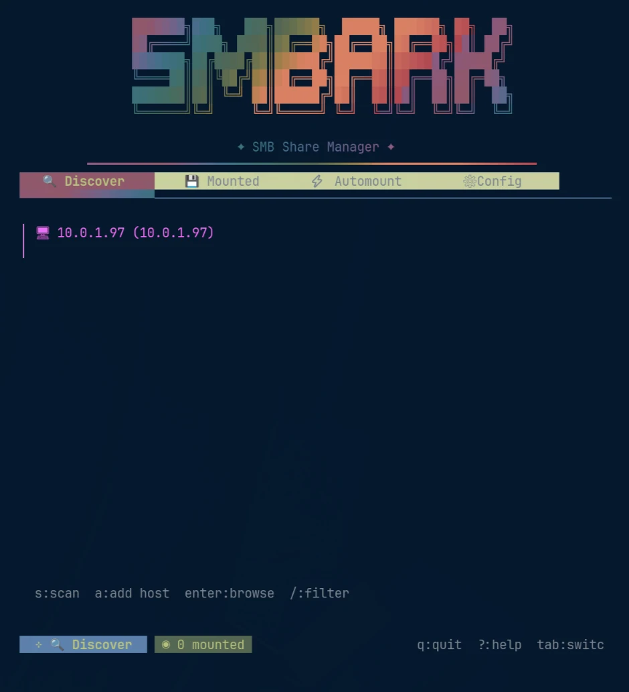
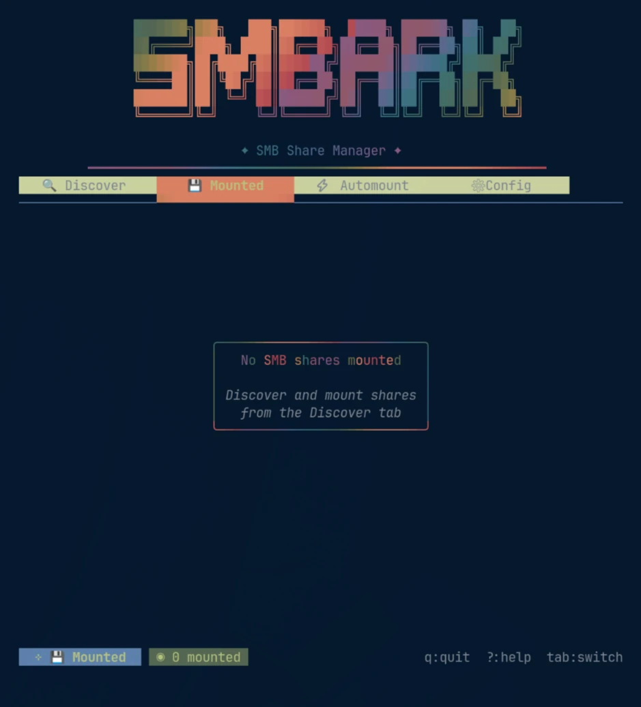
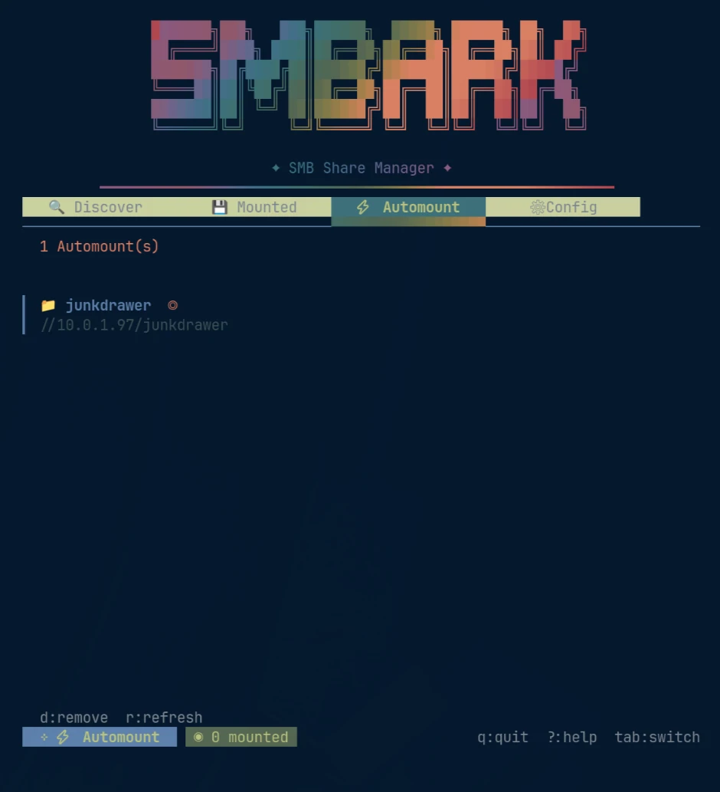
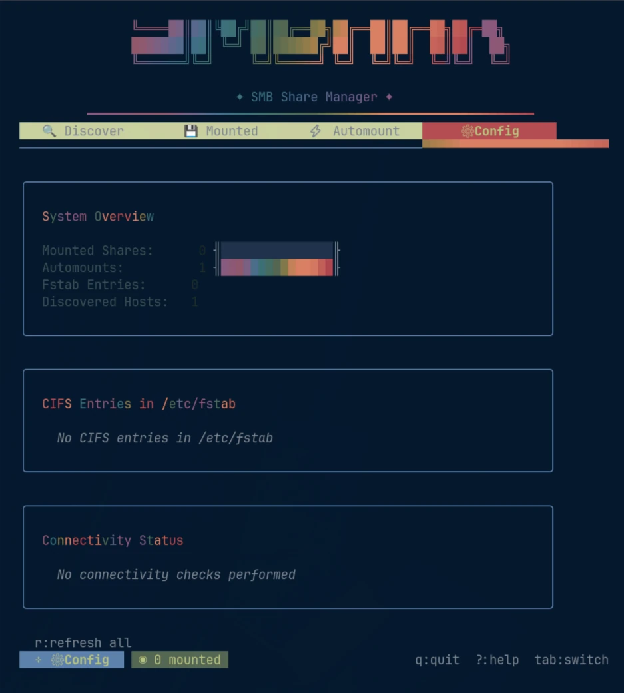

<div align="center">
  
  <p><strong>A terminal UI for discovering, mounting, and managing SMB shares on Linux.</strong></p>
  <p>
    <a href="https://smbark.z19r.com"><strong>smbark.z19r.com</strong></a>
    ·
    <a href="#install">Install</a>
    ·
    <a href="#usage">Usage</a>
  </p>
</div>

---

SMBark wraps the usual `smbclient` / `mount -t cifs` / systemd dance in a single terminal app. It scans your network for SMB hosts, browses their shares, mounts them with the options you want, and can persist those mounts as systemd automount units or `/etc/fstab` entries — without you hand-writing any of it.

Built with [Bubble Tea](https://github.com/charmbracelet/bubbletea), [Lip Gloss](https://github.com/charmbracelet/lipgloss), and [Bubbles](https://github.com/charmbracelet/bubbles).

<div align="center">
  
</div>

## Features

- **Network discovery** — finds SMB hosts via `avahi-browse` (mDNS) and `nmblookup` (NetBIOS), or add a host manually by IP or hostname.
- **Share browsing** — lists shares on a host through `smbclient`, with guest or credentialed access.
- **Mounting** — mounts via `mount -t cifs` with configurable SMB version, security mode, UID/GID, file and directory modes, and read-only toggle.
- **Persistent automounts** — generates systemd `.mount` and `.automount` units so shares mount on demand and survive reboots.
- **fstab management** — reads existing entries and can append new ones as an alternative to systemd.
- **Live mount view** — shows what's currently mounted with capacity from `df`, plus unmount and force-unmount (lazy).
- **Connectivity checks** — pings a host before you try to mount from it.
- **Omarchy theming** — picks up your active Omarchy theme automatically, with a built-in fallback palette.
- **Animated gradient text** throughout, because a mount manager may as well be nice to look at.

## Requirements

| Component | Provides | Needed for |
|---|---|---|
| `cifs-utils` | `mount.cifs` | Mounting shares (required) |
| `smbclient` (samba) | `smbclient`, `nmblookup` | Listing shares, NetBIOS discovery (required) |
| `avahi` | `avahi-browse` | mDNS discovery (optional — NetBIOS still works without it) |
| `systemd` | `systemctl`, `systemd-escape` | Automount units (optional) |

On Arch:

```bash
sudo pacman -S cifs-utils smbclient avahi
```

On Debian/Ubuntu:

```bash
sudo apt install cifs-utils smbclient avahi-utils
```

> **Note on sudo:** mounting and unmounting run through `sudo -n` (non-interactive), so SMBark never prompts for your password inside the TUI. You need either a live `sudo` timestamp (run any `sudo` command first) or a sudoers rule permitting `mount`, `umount`, and `systemctl` without a password. Without one, mount actions fail immediately rather than hanging.

## Install

**Pre-built binary** (no Go required):

```bash
curl -fsSL https://smbark.z19r.com/install.sh | sh
```

Detects your architecture (x86_64 / ARM64) and installs to `/usr/local/bin`.

**With Go:**

```bash
go install github.com/z19r/smbark@latest
```

**From source:**

```bash
git clone https://github.com/z19r/smbark.git
cd smbark
just build      # or: go build -o smbark .
just install    # copies to /usr/local/bin (uses sudo)
```

Requires Go 1.26 or newer.

## Usage

```bash
smbark
```

The interface is four tabs, switched with <kbd>Tab</kbd> / <kbd>Shift+Tab</kbd>:

| Tab | Purpose |
|---|---|
| 🔍 **Discover** | Scan the network, browse hosts, mount shares |
| 💾 **Mounted** | View, unmount, and inspect active mounts |
| ⚡ **Automount** | Manage persistent systemd automounts |
| ⚙ **Config** | Default mount options |

### Keybindings

**Global**

| Key | Action |
|---|---|
| <kbd>Tab</kbd> / <kbd>Shift+Tab</kbd> | Switch tabs |
| <kbd>?</kbd> | Toggle help |
| <kbd>Esc</kbd> | Go back |
| <kbd>q</kbd> / <kbd>Ctrl+C</kbd> | Quit (from the main view) |

**Discover**

| Key | Action |
|---|---|
| <kbd>s</kbd> / <kbd>r</kbd> | Scan network for SMB hosts |
| <kbd>a</kbd> | Add a host manually by IP or hostname |
| <kbd>Enter</kbd> | Browse host shares / open action menu |
| <kbd>/</kbd> | Filter hosts |
| <kbd>c</kbd> | Check host connectivity |

**Mounted**

| Key | Action |
|---|---|
| <kbd>u</kbd> | Unmount selected share |
| <kbd>f</kbd> | Force unmount (lazy) |
| <kbd>r</kbd> | Refresh mount list |

**Automount**

| Key | Action |
|---|---|
| <kbd>d</kbd> / <kbd>Del</kbd> | Remove automount |
| <kbd>r</kbd> | Refresh automount list |

## Screenshots

<div align="center">
  
  
  <br><br>
  
</div>

## Mount options

Defaults are SMB `3.0`, your current UID/GID, and `0755` for both file and directory modes. Each is adjustable in the **Config** tab, or per-mount when you mount a share:

| Option | Description |
|---|---|
| Version | SMB protocol version (`1.0`, `2.0`, `2.1`, `3.0`, …) |
| Security | Security mode (`ntlmssp`, `krb5`, …) |
| UID / GID | Owner of the mounted files |
| File mode | Permissions for files |
| Dir mode | Permissions for directories |
| Read-only | Mount without write access |
| Mount point | Where the share is mounted |

## Theming

SMBark reads your active [Omarchy](https://omarchy.org/) theme, checking in order:

1. `~/.local/state/omarchy/current/theme/colors.toml` — the live theme
2. `~/.config/omarchy/themes/*/colors.toml`
3. `~/.local/share/omarchy/themes/*/colors.toml`

If none is found it falls back to a built-in palette, so it looks correct on any system — Omarchy is not a requirement.

## Development

```bash
just            # list all targets
just build      # build the binary
just run        # build and run
just check      # go vet + build
just fmt        # gofmt -w .
just lint       # golangci-lint
just tidy       # go mod tidy
just test       # run all tests
just pre-commit # fmt + vet + build
just ci-local   # lint-all + test
just info       # show toolchain versions
just loc        # line count
```

The landing page lives in `site/`:

```bash
just site-dev      # serve locally on :8080
just site-preview  # Netlify draft deploy
just site-deploy   # Netlify production deploy
```

## Releasing

Releases are cut from `main` using the justfile. The `release` recipe bumps the version in `VERSION`, auto-generates a changelog entry from conventional commits, opens a PR, waits for CI, merges, and tags.

```bash
just release-dry-run patch   # preview without changing anything
just release patch           # patch release (0.1.0 → 0.1.1)
just release minor           # minor release (0.1.1 → 0.2.0)
just release major           # major release (0.2.0 → 1.0.0)
```

The full flow:

1. Runs the quality gate (`gofmt` check, `go vet`, `go test`)
2. Bumps the semver in `VERSION`
3. Generates a changelog section from conventional commits since the last tag
4. Creates a `release/vX.Y.Z` branch, commits, and pushes
5. Opens a PR against `main` via `gh`
6. Watches CI (if configured), then squash-merges
7. Tags `vX.Y.Z` on `main` and pushes the tag
8. Cross-compiles binaries for `linux/amd64` and `linux/arm64`
9. Creates a GitHub release with the binaries attached

Requires [`gh`](https://cli.github.com/) to be installed and authenticated.

Pre-built binaries are available on the [releases page](https://github.com/z19r/smbark/releases).

## Project layout

```
main.go              entry point
internal/
  smb/               discovery, mounting, automount, fstab
  theme/             Omarchy theme loading and palette
  ui/                Bubble Tea model, tabs, messages
    components/      share list, header, dialogs, effects
site/                landing page (static, deployed via Netlify)
```

## License

[MIT](LICENSE) © Zack Kitzmiller
